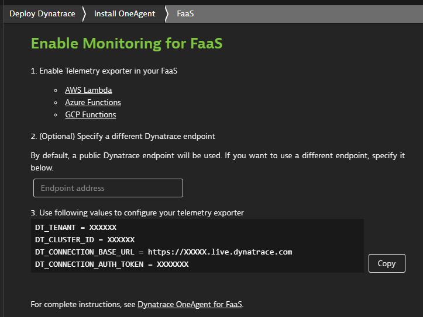

# Azure Functions 
Azure Functions offer a wide range of options   
* To use your preferred language 
* To automate deployment
* With flexible [hosting](https://docs.microsoft.com/en-us/azure/azure-functions/functions-scale)

to adress the various [scenarios and use-cases](https://docs.microsoft.com/en-us/azure/azure-functions/functions-overview#scenarios).

# Trace Azure Functions
Dynatrace offers an easy integration to [trace Azure Functions running on Appservice-Plan](https://www.dynatrace.com/support/help/setup-and-configuration/setup-on-cloud-platforms/microsoft-azure-services/integrate-oneagent-on-azure-functions/)

But tracing Azure Functions on a Consumption- or Dedicated-Plan, comes with certain challenges to it's nature of a fully managed service such as e.g. automatically instrument these functions as it is possible on Appservice Plans. 

## Using OpenTelemetry
OpenTelemetry is a great solution to trace those functions. While OpenTelemetry for .NET Core comes with a broad support of built-in auto-instrumentation, limitations within the Azure Function runtime require to apply some workarounds.

Limitations:
* https://github.com/Azure/azure-functions-host/issues/7135 Unable to use auto-instrumentation (e.g. HttpClient, SQLClient) provided within .NET framework
* https://github.com/open-telemetry/opentelemetry-dotnet/issues/1803#issuecomment-800608308 Unable to intialize Opentelemetry using AddOpenTelemetryTracing extension method

The limitations only apply to function written in [C# (class libaries), C# script (.csx) and F# (.fsx)](https://docs.microsoft.com/en-us/azure/azure-functions/supported-languages#language-support-details) which are executed in the [in-process model](https://docs.microsoft.com/en-us/azure/azure-functions/dotnet-isolated-process-guide#differences-with-net-class-library-functions)

The following sample application demonstrates end-2-end traceability using OpenTelemetry.  

# The Demo Function App
[TimerTriggerdFunction] -> (http) -> [HttpTriggeredFunction] -> (ServiceBusQueue) -> [ServiceBusTriggeredFunction] -> (http) -> [Outbound Service]

## Prerequisites 
* A Dynattrace Environment
* [OTLP enabled endpoint to send trace data to Dynatrace](https://www.dynatrace.com/support/help/extend-dynatrace/opentelemetry/opentelemetry-ingest/)

## Application Configuration 
After checking out the repository create a file named "local.settings.json" in your function project folder "AzFuncOpenTelemetryDemo" with following structure

````
{
  "IsEncrypted": false,
  "Values": {
    "AzureWebJobsStorage": "UseDevelopmentStorage=true",
    "FUNCTIONS_WORKER_RUNTIME": "dotnet",

    "SBConnection": "Endpoint=sb://XXXXX.servicebus.windows.net/;SharedAccessKeyName=RootManageSharedAccessKey;SharedAccessKey=XXXXXXXXXX",
    "WebTriggerUrl": "",
    "OutboundServiceUrl": "https://myotherservice.com",

    "otel.service.name": "AzFuncQueueDemo",
    "otel.instrumetnationlibary": "OpenTelemetryDemo.AzFuncQueueDemo",

    "DT_TENANT": "XXXXX",
    "DT_CLUSTER_ID": "XXXXX",
    "DT_CONNECTION_AUTH_TOKEN": "XXXXX",
    "DT_CONNECTION_BASE_URL": "XXXXX"
  }
}
````

| Parameter | Description | Required |
| --- | --- | --- |
| SBConnection | Azure ServiceBus ConnectionString | Yes |
| WebTriggerUrl | Url of the HttpTriggered Function  | Yes, if published to Azure, otherwise local endpoint is used as default |
| OutboundServiceUrl | Url of an external service | Optional |
| otel.service.name | [Logical name of the service](https://github.com/open-telemetry/opentelemetry-specification/blob/main/specification/resource/semantic_conventions/README.md#service) | Yes |
| otel.instrumentationlibrary | The name to be provided as Instrumentationlibrary for your custom instrumentations | No, defaults to "Custom" |

### Dynatrace Connection Parameters

| Parameter | Description | Required |
| --- | --- | --- |
| DT_TENANT | Dynatrace Tenant-Id | Yes |
| DT_CLUSTER_ID | Dynatrace Cluster-Id | Yes |
| DT_CONNECTION_AUTH_TOKEN | Dynatrace authentication token | Yes|
| DT_CONNECTION_BASE_URL | Dynatrace endpoint to send the trace data. | Yes |

The parameters to configure Dynatrace connection parameters can be retrieved via Dynatrace UI in **Deploy Dynatrace > FaaS**


### Publishing Your Azure Function
If the function service is published to Azure, these parameters have to be applied via the [Functions application settings](https://docs.microsoft.com/en-us/azure/azure-functions/functions-how-to-use-azure-function-app-settings?tabs=portal#settings)


## Code Instrumentation 

### Prerequisites
Before you can use dependency injection, OpenTelemetry or the Dynatrace Instrumentation libraries following NuGet packages have to be added to the Function project:

* *Microsoft.Azure.Functions.Extensions*
* *Microsoft.NET.Sdk.Functions package* version 1.0.28 or later
* *Microsoft.Extensions.DependencyInjection* (currently, only version 3.x and earlier supported)
* *Dynatrace.OpenTelemetry*
* *Dynatrace.OpenTelemetry.Instrumentation*

### Initializing OpenTelemetry
In the sample application, OpenTelemetry is initialized using dependency injection within the [FunctionStartup](https://docs.microsoft.com/en-us/azure/azure-functions/functions-dotnet-dependency-injection) in Startup.cs. While this is not a must, it helps you to keep your function code separated from your functions configuration needs. 

#### Sending traces to Dynatrace
The Dynatrace.OpenTelemetry library provides a TracerProviderBuilder Extension (AddDynatraceExporter) function which automatically configures the Traceprovider to send the traces to Dynatrace. 

````
[assembly: FunctionsStartup(typeof(AzFuncQueueDemo.Startup))]
namespace AzFuncQueueDemo
{
    public class Startup : FunctionsStartup
    {
        public override void Configure(IFunctionsHostBuilder builder)
        {
            //Defines the OpenTelemetry instrumentation library
            string activitySource = Environment.GetEnvironmentVariable("otel.instrumetnationlibary")??"Custom";

            //Do not use builder.Services.AddOpenTelemetryTracing (https://github.com/open-telemetry/opentelemetry-dotnet/issues/1803#issuecomment-800608308)
            builder.Services.AddSingleton((builder) =>
            {
                return Sdk.CreateTracerProviderBuilder()
                    .SetSampler(new AlwaysOnSampler())
                    .AddDynatraceExporter() //Configures to send traces to Dynatrace, automatically reading configuration from environmetn variables.
                    .SetResourceBuilder(ResourceBuilder.CreateDefault().AddService(Environment.GetEnvironmentVariable("otel.service.name") ??"defaultservice"))
                    //.AddHttpClientInstrumentation() doesn't work:  https://github.com/Azure/azure-functions-host/issues/7135 ...
                    //..instead use an alternative instrumentation not relying on DiagnosticListener
                    .AddTraceMessageHandlerInstrumentation()  //Requires to use TraceMessageHandler as a DelegationHandler for HttpClient (registered below)
                    .AddServiceBusSenderInstrumentation()  //Requires to use TracedServiceBusSender vs ServiceBusSender
                    .AddSource(activitySource) //register activitysource used for custom instrumentation
                    .Build();
            });
          ...
        }
    }
````

### Instrument your functions 
OpenTelemetry for .NET provides a broad set of [auto-instrumentation](https://github.com/open-telemetry/opentelemetry-dotnet) for e.g. Sqlclient or HttpClient based on the pre-instrumented .NET Framework. Other frameworks such as the [ServiceBus Client SDK are pre-instrumented](https://docs.microsoft.com/en-us/azure/service-bus-messaging/service-bus-end-to-end-tracing?tabs=net-standard-sdk-2) come as well pre-instrumented. But due to the current limitations developers need to take care of instrumentation and context-propagation. 

To reduce instrumentation boilerplate code, such as setting semantic conventions and propagating trace-context, an alternative auto-instrumentation library (Dynatrace.OpenTelemetry.Instrumentation) is provided to reduce additional code to instrument your functions. 

The additional added code for instrumentation is marked with code-comments starting with *//Instrumentation:*

````
[FunctionName("WebTrigger")]
public async Task<IActionResult> RunWebTrigger([HttpTrigger(AuthorizationLevel.Anonymous, "get", Route = null)] HttpRequest req, ILogger log)
{
    //Instrumentation: create root-span using extension method provided in Dynatrace.OpenTelemetry.Instrumentation,
    //that automatically propagates tracecontext from incoming httprequest object
    using (var activity = _activitySource.StartActivity("WebTrigger", ActivityKind.Server, req)) 
    {
        var client = new ServiceBusClient(Environment.GetEnvironmentVariable(envSBConnectionStr));
        
        //Instrumentation: use an instrumented shim of the ServiceBusSender
        var sender = new TracedServiceBusSender(client.CreateSender(QueueName));
  
        await sender.SendMessageAsync(new ServiceBusMessage($"Message {DateTime.Now}"));
        
    }

    return new OkObjectResult("Ok");
}
````

To learn more about .NET instrumentation with Opentelemetry visit [Opentelemetry .NET on Github](https://github.com/open-telemetry/opentelemetry-dotnet/blob/main/src/OpenTelemetry.Api/README.md#instrumenting-a-libraryapplication-with-net-activity-api)


# Step-By-Step to run the demo
1. Prepare Dynatrace Environment
    * Make sure W3C Trace-Context is enabled.  
        * From the Dynatrace menu, go to **Settings > Server-side service monitoring > Deep monitoring > Distributed tracing**.
        * Turn on "Send W3C Trace Context HTTP headers".
    * [Create an API Token](https://www.dynatrace.com/support/help/get-started/access-tokens/#anchor_api) with the **Ingest OpenTelemetry traces** (openTelemetryTrace.ingest) scope
3. [Prepare your Dev-Environment to develop Azure Functions](https://docs.microsoft.com/en-us/azure/azure-functions/functions-develop-local)
4. Checkout this repository 
    ````
    git clone https://github.com/dtPaTh/AzFuncOpenTelemetryDemo
    ````
5. [Configure your Azure-Function-App](#Application-Configuration)
6. Build and Run your App
7. [Verify that the traces are being ingested into Dynatrace](https://www.dynatrace.com/support/help/extend-dynatrace/opentelemetry/opentelemetry-ingest/#verify-ingestion)


## End-2-End Tracing in combination with OneAgent instrumented services
Dynatrace PurePath Technology allows to mix and match distributed traces from applications instrumented with OpenTelemetry and/or OneAgent. 

The following screenshots show an enhanced setup of the above sample with an inbound and outbound service, both instrumented with the OneAgent. 


