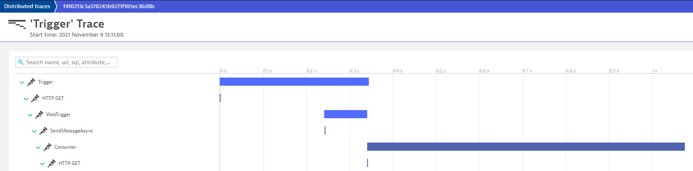
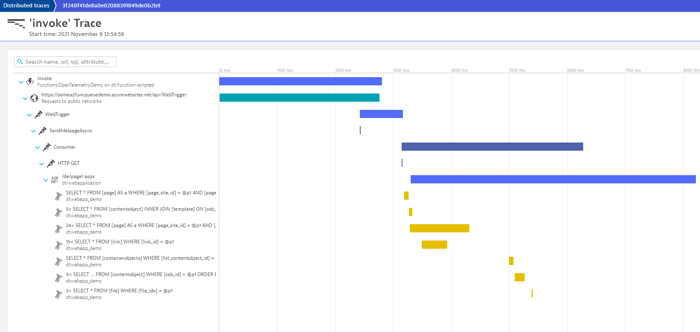
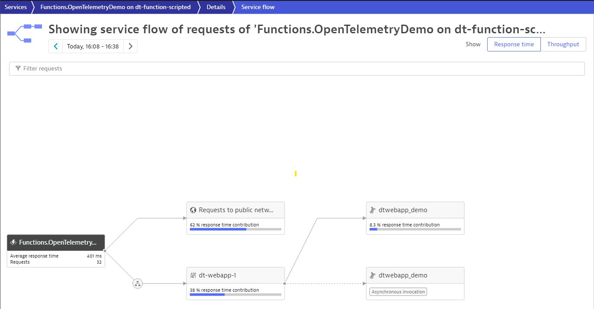

# Azure Functions 
Azure Functions offer a wide range of options   
* To use your preferred language 
* To automate deployment
* With flexible pricing
to adress the various [scenarios and use-cases](https://docs.microsoft.com/en-us/azure/azure-functions/functions-overview#scenarios).

# Trace Azure Functions
Dynatrace offers an easy integration to [trace Azure Functions running on Appservice-Plan](https://www.dynatrace.com/support/help/setup-and-configuration/setup-on-cloud-platforms/microsoft-azure-services/integrate-oneagent-on-azure-functions/)

But tracing Azure Functions on a Consumption- or Dedicated-Plan, comes with certain challenges to it's nature of a fully managed service such as e.g. automatically instrument these functions as it is possible on Appservice Plans. 

## Using OpenTelemetry
OpenTelemetry is a great solution to trace those functions. While OpenTelemetry for .NET Core comes with a broad support of built-in auto-instrumentation, limitations within the Azure Function runtime require to apply some workarounds.

Limitations:
* https://github.com/Azure/azure-functions-host/issues/7135 Unable to use auto-instrumentation (e.g. HttpClient, SQLClient) provided within .NET framework
* https://github.com/open-telemetry/opentelemetry-dotnet/issues/1803#issuecomment-800608308 Unable to intialize Opentelemetry using AddOpenTelemetryTracing extension method

The follwoing sample application demonstrates end-2-end traceability using OpenTelemetry in combination with other workloads monitored with Dynatrace OneAgent.  

# The Demo Function App
[TimerTriggerdFunction] -> (http) -> [HttpTriggeredFunction] -> (ServiceBusQueue) -> [ServiceBusTriggeredFunction] -> (http) -> [Outbound Service]

## Prerequisites 
* A Dynattrace Environment
* [OTLP enabled endpoint to send trace data to Dynatrace](https://www.dynatrace.com/support/help/extend-dynatrace/opentelemetry/opentelemetry-ingest/)

## Application Configuration 
After checking out the repository create a file named "local.settings.json" in your function project folder "AzFuncOpenTelemetryDemo" with following structure

````
{
  "IsEncrypted": false,
  "Values": {
    "AzureWebJobsStorage": "UseDevelopmentStorage=true",
    "FUNCTIONS_WORKER_RUNTIME": "dotnet",

    "SBConnection": "Endpoint=sb://XXXXX.servicebus.windows.net/;SharedAccessKeyName=RootManageSharedAccessKey;SharedAccessKey=XXXXXXXXXX",
    "WebTriggerUrl": "",
    "OutboundServiceUrl": "https://myotherservice.com",

    "OTLPEndpoint": "https://xxxxxxxx.live.dynatrace.com/api/v2/otlp"
    "DT_API_TOKEN": "xxxxx"
    
    "otel.service.name": "AzFuncQueueDemo",
    "otel.instrumetnationlibary": "OpenTelemetryDemo.AzFuncQueueDemo"

  }
}
````

| Parameter | Description | Required |
| --- | --- | --- |
| SBConnection | Azure ServiceBus ConnectionString | Yes |
| WebTriggerUrl | Url of the HttpTriggered Function  | Yes, if published to Azure, otherwise local endpoint is used as default |
| OutboundServiceUrl | Url of an external service | Optional |
| OTLPEndpoint | An OTLP capable endpoint to send the trace data. If no value is provided the default endpoint on localhost is used. | Yes |
| DT_API_TOKEN | Dynatrace API Token with the **Ingest OpenTelemetry traces** (openTelemetryTrace.ingest) scope | Only needed if the OTLP endpoint of Dynatrace is used. Not needed if a collector is used. |
| otel.service.name | Your service identifier provided as resource attribute "service.name" | Yes |
| otel.instrumentationlibrary | The name to be provided as Instrumentationlibrary for your custom instrumentations | No, defaults to "Custom" |

If the function service is published to Azure, these parameters have to be applied via the [Functions application settings](https://docs.microsoft.com/en-us/azure/azure-functions/functions-how-to-use-azure-function-app-settings?tabs=portal#settings)


## Code Instrumentation 
OpenTelemetry for .NET provides a broad set of [auto-instrumentation](https://github.com/open-telemetry/opentelemetry-dotnet) for e.g. Sqlclient or HttpClient based on the pre-instrumented .NET Framework. Additioanl frameworks such as the [ServiceBus Client SDK are pre-instrumented](https://docs.microsoft.com/en-us/azure/service-bus-messaging/service-bus-end-to-end-tracing?tabs=net-standard-sdk-2) as well. But due to the current 
limitations developers need to take care of instrumentation and context-propagation. 

To reduce instrumentation boilerplate code, such as setting semantic conventions and propagating trace-context, an alternative auto-instrumentation library (Dynatrace.OpenTelemetry.Instrumentation) is provided to reduce additional code to instrument your functions. 

OpenTelemetry is initialized using DependencyInjection within the FunctionStartup in Startup.cs. 

The additional added code for instrumentation is marked with code-comments starting with *//Todo:*

To learn more about .NET instrumentation with Opentelemetry visit [Opentelemetry .NET on Github](https://github.com/open-telemetry/opentelemetry-dotnet/blob/main/src/OpenTelemetry.Api/README.md#instrumenting-a-libraryapplication-with-net-activity-api)

# Sending traces to Dynatrace
Dynatrace supports ingestion of traces using the OTLP/HTTP binary format. Until OpenTelemetry OTLP Exporter for .NET v1.1.0, only OTLP/GRPC protocol is supported which requires to use an [OpenTelemetry colllector](https://github.com/open-telemetry/opentelemetry-collector) forwarding the traces to Dynatrace. Version 1.2.0, adds support for OTLP/HTTP binary format, allowing to send the traces directly to Dynatrace from your application. 

To reduce complexitity in the demo setup, OpenTelemetry OTLP Exporter for .NET **v1.2.0-beta1** is used. 

Dynatrace.OpenTelemetry library provides a TracerProviderBuilder Extension function which automatically configures the traceprovider to send the traces to Dynatrace. 

See following [instructions to activate the Dynatrace OTLP endpoint](https://www.dynatrace.com/support/help/how-to-use-dynatrace/transactions-and-services/purepath-distributed-traces/opentelemetry-ingest/#activate)

# Step-By-Step to run the demo
1. Prepare Dynatrace Environment
    * Make sure W3C Trace-Context is enabled.  
        * From the Dynatrace menu, go to **Settings > Server-side service monitoring > Deep monitoring > Distributed tracing**.
        * Turn on "Send W3C Trace Context HTTP headers".
    * [Create an API Token](https://www.dynatrace.com/support/help/get-started/access-tokens/#anchor_api) with the **Ingest OpenTelemetry traces** (openTelemetryTrace.ingest) scope
3. [Prepare your Dev-Environment to develop Azure Functions](https://docs.microsoft.com/en-us/azure/azure-functions/functions-develop-local)
4. Checkout this repository 
    ````
    git clone https://github.com/dtPaTh/AzFuncOpenTelemetryDemo
    ````
5. [Configure your Azure-Function-App](#Application-Configuration)
6. Build and Run your App
7. [Verify that the traces are being ingested into Dynatrace](https://www.dynatrace.com/support/help/extend-dynatrace/opentelemetry/opentelemetry-ingest/#verify-ingestion)



## End-2-End Tracing in combination with OneAgent instrumented services
Dynatrace PurePath Technology allows to mix and match distributed traces from applications instrumented with OpenTelemetry and/or OneAgent. 

The following screenshots show an enhanced setup of the above sample with an inbound and outbound service, both instrumented with the OneAgent. 





# Running the collector as a docker container (optional)
OpenTelemetry provides a docker image for the collector. To use this image a collector config needs to be applied. 

Within this project a sample collector config is included (otel_collector_config.yaml) which enables OTLP receivers and a OLTP/HTTP sender adding authentication headers. The target endpoint and authentication token is configured through environment variables.  
```
receivers:
  otlp:
    protocols:
      grpc:
        endpoint: 0.0.0.0:55680
      http:
        endpoint: 0.0.0.0:55681
exporters:
  otlphttp:
    endpoint: "${DT_OTLPHTTP_ENDPOINT}"
    headers: {"Authorization": "Api-Token ${DT_API_TOKEN}"}
  logging:
    loglevel: debug
    sampling_initial: 5
    sampling_thereafter: 200
service:
  pipelines:
    traces:
      receivers: [otlp]
      processors: []
      exporters: [logging,otlphttp]
```

| Environment Variable | Description | Required |
| --- | --- | --- |
| DT_OTLPHTTP_ENDPOINT | Your Dynatrace OTLP Endpoint. Example: https://xxxxxxxx.live.dynatrace.com/api/v2/otlp |
| DT_API_TOKEN | Your Dynatrace API Token |

### Run a collector as a docker locally for testing 

Linux
```
docker run -p 55680:55680 -p 55681:55681 -e DT_OTLPHTTP_ENDPOINT="<YOUR-DYNATRACE-OTLP-ENDPOINT>" -e DT_API_TOKEN="<YOUR-DYNATRACE-API-TOKEN>" -v  $(pwd)/otel_collector_config.yaml:/etc/otel/config.yaml otel/opentelemetry-collector-contrib
```

Windows Powershell
```
docker run -p 55680:55680 -p 55681:55681 -e DT_OTLPHTTP_ENDPOINT="<YOUR-DYNATRACE-OTLP-ENDPOINT>" -e DT_API_TOKEN="<YOUR-DYNATRACE-API-TOKEN>" -v  ${pwd}/otel_collector_config.yaml:/etc/otel/config.yaml otel/opentelemetry-collector-contrib
```

Your command then may look similar like this if your are using a Dynatrace SaaS endpoint. 
```
docker run -p 55680:55680 -p 55681:55681 -e DT_OTLPHTTP_ENDPOINT="https://xxxxxxxx.live.dynatrace.com/api/v2/otlp" -e DT_API_TOKEN="xxxxxx.xxxxxxxxxxxxxxxxxxxxxxxx.xxxxxxxxxxxxxxxxxxxxxxxxxxxxxxxxxxxxxxxxxxxxxxxxxxxxxxxxxxxxxxxx" -v  $(pwd)/otel_collector_config.yaml:/etc/otel/config.yaml otel/opentelemetry-collector-contrib
```
### Build a docker image for you collector, you can run in your container platform of choice

Within this project a sample dockerfile is included (otel_collector.Dockerfile) packaging the collector config "otel_collector_config.yaml"

#### Create a docker image to include your OpenTelemetry collector config
```
docker build -t dt-otlp-collector . -f otel_collector.Dockerfile
```


